Experiments
===========

Interactive charts, graphs, raw data, run commands, hyperparameter choices, and more for all experiments are publicly available on the `TransformerSum Weights & Biases page <https://app.wandb.ai/hhousen/transformerextsum>`__. You can download the raw data for each model on this site, or `download an overview as a CSV <../_static/summarization-model-experiments-raw-data.csv>`__. Please open an `issue <https://github.com/HHousen/TransformerSum/issues/new>`__ if you have questions about these experiments.

Important notes when running experiments:

* If you are using ``--overfit_batches``, then ``overfit_batches`` percent of the testing data is being used as well as ``overfit_batches`` percent of the training data. Due to the way ``pytorch_lightning`` was written, it is necessary to use the same ``batch_size`` when using ``overfit_batches`` in order to get the exact same results. I currently am not sure why this is the case but removing ``overfit_batches`` and using different ``batch_size``\ s produces identical results. Open an `issue <https://github.com/HHousen/TransformerSum/issues/new>`__ or submit a pull request if you know why.
* Have another note that should be stated here? Open an `issue <https://github.com/HHousen/TransformerSum/issues/new>`__. All contributions are very helpful.

The :ref:`older_experiments` were conducted on a previous version of ``TransformerSum`` that contained bugs. Thus, the scores and graphs of the older experiments don't represent model performance but their results relative to each other should still be accurate. The :ref:`newer_experiments` were conducted on a new version without bugs and thus should be easily reproducible.

.. _experiments_version_3:

Version 3
---------

All version 3 extractive models were trained for three epochs with gradient accumulation every two steps. The AdamW optimizer was used with :math:`\beta_1=0.9`, :math:`\beta_2=0.999`, and :math:`\epsilon=1\mathrm{e}{-8}`. Models were trained on one NVIDIA Tesla P100 GPU. Unless otherwise specified, the learning rate was 2e-5 and a linear warmup with decay learning rate scheduler was used with 1400 steps of warmup (technically 2800 steps due to gradient accumulation every two steps). Except during their respective experiments, the ``simple_linear`` classifier and ``sent_rep_tokens`` pooling method are used. Gradients are clipped at 1.0 during training for all models. Model checkpoints were saved and evaluated on the validation set at the end of each epoch. ROUGE scores are reported on the test set of the model checkpoint saved after the final epoch.

.. _experiments_version_3_pooling_mode:

Pooling Mode
^^^^^^^^^^^^

`Wandb Tag <https://app.wandb.ai/hhousen/transformerextsum>`_: ``pooling-mode-test-v3``

All three pooling modes (``mean_tokens``, ``sentence_rep_tokens``, and ``max_tokens``) were tested using DistilBERT and DistilRoBERTa, which are warm started from the ``distilbert-base-uncased`` and ``distilroberta-base`` checkpoints, respectively. I only test the ``distil*`` models since they reach at least 95% of the performance of the original model while being significantly faster to train. The models were trained and tested on CNN/DailyMail, WikiHow, and ArXiv/PubMed to determine if certain methods worked better with certain topics. All models were trained with a batch size of 32 and the hyperparameters discussed in above at :ref:`experiments_version_3`.

Pooling Mode Results
~~~~~~~~~~~~~~~~~~~~

**ROUGE Scores:**

+-------------------------+----------------+-------------------+-------------------+-------------------+
| Model                   | Pooling Method | CNN/DM            | WikiHow           | ArXiv/PubMed      |
+=========================+================+===================+===================+===================+
| distilbert-base-uncased | sent_rep       | 42.71/19.91/39.18 | 30.69/08.65/28.58 | 34.93/12.21/31.00 |
|                         +----------------+-------------------+-------------------+-------------------+
|                         | mean           | 42.70/19.88/39.16 | 30.48/08.56/28.42 | 34.48/11.89/30.61 |
|                         +----------------+-------------------+-------------------+-------------------+
|                         | max            | 42.74/19.90/39.17 | 30.51/08.62/28.43 | 34.50/11.91/30.62 |
+-------------------------+----------------+-------------------+-------------------+-------------------+
| distilroberta-base      | sent_rep       | 42.87/20.02/39.31 | 31.07/08.96/28.95 | 34.70/12.16/30.82 |
|                         +----------------+-------------------+-------------------+-------------------+
|                         | mean           | 43.00/20.08/39.42 | 30.96/08.93/28.86 | 34.24/11.82/30.42 |
|                         +----------------+-------------------+-------------------+-------------------+
|                         | max            | 42.91/20.04/39.33 | 30.93/08.92/28.82 | 34.28/11.82/30.44 |
+-------------------------+----------------+-------------------+-------------------+-------------------+

**Main Takeaway:** Across all datasets and models, the pooling mode has no significant impact on the final ROUGE scores. However, the sent_rep method usually performs slightly better. Additionally, the mean and max methods are about 30% slower than the sent_rep pooling method.

Classifier/Encoder
^^^^^^^^^^^^^^^^^^

`Wandb Tag <https://app.wandb.ai/hhousen/transformerextsum>`_: ``encoder-test-v3``

All four summarization layers, including two variations of the \verb|transformer| method for a total of five configurations, were tested using the same models and datasets from the :ref:`pooling modes experiment <experiments_version_3_pooling_mode>`. For this experiment, a batch size of 32 was used.

Classifier/Encoder Results
~~~~~~~~~~~~~~~~~~~~~~~~~~

**ROUGE Scores:**

+-------------------------+--------------------+-------------------+-------------------+-------------------+
| Model                   | Classifier         | CNN/DM            | WikiHow           | ArXiv/PubMed      |
+=========================+====================+===================+===================+===================+
| distilbert-base-uncased | simple_linear      | 42.71/19.91/39.18 | 30.69/08.65/28.58 | 34.93/12.21/31.00 |
|                         +--------------------+-------------------+-------------------+-------------------+
|                         | linear             | 42.70/19.84/39.14 | 30.67/08.62/28.56 | 34.87/12.20/30.96 |
|                         +--------------------+-------------------+-------------------+-------------------+
|                         | transformer        | 42.78/19.93/39.22 | 30.66/08.69/28.57 | 34.94/12.22/31.03 |
|                         +--------------------+-------------------+-------------------+-------------------+
|                         | transformer_linear | 42.78/19.93/39.22 | 30.64/08.64/28.54 | 34.97/12.22/31.02 |
+-------------------------+--------------------+-------------------+-------------------+-------------------+
| distilroberta-base      | simple_linear      | 42.87/20.02/39.31 | 31.07/08.96/28.95 | 34.70/12.16/30.82 |
|                         +--------------------+-------------------+-------------------+-------------------+
|                         | linear             | 43.18/20.26/39.61 | 31.08/08.98/28.96 | 34.77/12.17/30.88 |
|                         +--------------------+-------------------+-------------------+-------------------+
|                         | transformer        | 42.94/20.03/39.37 | 31.05/08.97/28.93 | 34.77/12.17/30.87 |
|                         +--------------------+-------------------+-------------------+-------------------+
|                         | transformer_linear | 42.90/20.00/39.34 | 31.13/09.01/29.02 | 34.77/12.18/30.88 |
+-------------------------+--------------------+-------------------+-------------------+-------------------+

**Main Takeaway:** There is no significant difference between the classifier used. Thus, you should use the linear classifier by default since it contains fewer parameters.

.. _newer_experiments:

Version 2
---------

Classifier/Encoder ``simple_linear`` vs ``linear``
^^^^^^^^^^^^^^^^^^^^^^^^^^^^^^^^^^^^^^^^^^^^^^^^^^

Commit `dfefd15` added a :class:`~classifier.SimpleLinearClassifier`. This experiment servers to determine if ``simple_linear`` (:class:`~classifier.SimpleLinearClassifier`) is better than ``linear`` (:class:`~classifier.LinearClassifier`).

Command used to run the tests:

.. code-block:: 

   python main.py \
   --model_name_or_path distilbert-base-uncased \
   --model_type distilbert \
   --no_use_token_type_ids \
   --use_custom_checkpoint_callback \
   --data_path ./pt/bert-base-uncased \
   --max_epochs 3 \
   --accumulate_grad_batches 2 \
   --warmup_steps 1400 \
   --gradient_clip_val 1.0 \
   --optimizer_type adamw \
   --use_scheduler linear \
   --do_train --do_test \
   --batch_size 32 \
   --classifier [`linear` or `simple_linear`]

Classifier/Encoder Results
~~~~~~~~~~~~~~~~~~~~~~~~~~

**Training Times and Model Sizes:**

+-------------------+------------+------------+
| Model Key         | Time       | Model Size |
+===================+============+============+
| ``linear``        | 6h 28m 21s | 810.6MB    |
+-------------------+------------+------------+
| ``simple_linear`` | 6h 22m 32s | 796.4MB    |
+-------------------+------------+------------+

**ROUGE Scores:**

+-------------------+---------+---------+---------+-------------+
| Name              | ROUGE-1 | ROUGE-2 | ROUGE-L | ROUGE-L-Sum |
+===================+=========+=========+=========+=============+
| ``linear``        | 42.8    | 19.9    | 27.5    | 39.2        |
+-------------------+---------+---------+---------+-------------+
| ``simple_linear`` | 42.7    | 19.9    | 27.5    | 39.2        |
+-------------------+---------+---------+---------+-------------+

**Main Takeaway:** There is no significant difference in performance between the ``linear`` and ``simple_linear`` classifiers/encoders. However, ``simple_linear`` is better due to its lower training and validation loss.

**Outliers Included:**

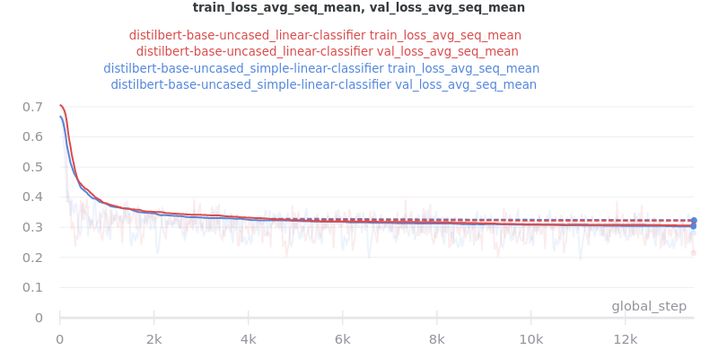

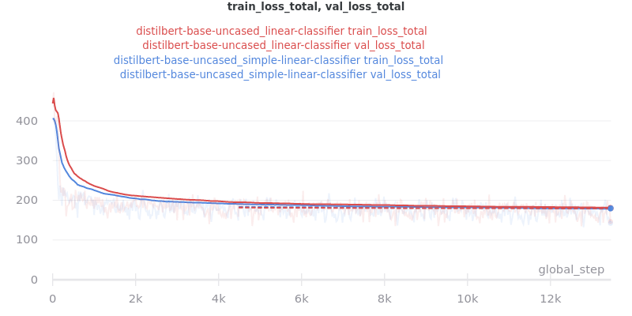

**No Outliers:**

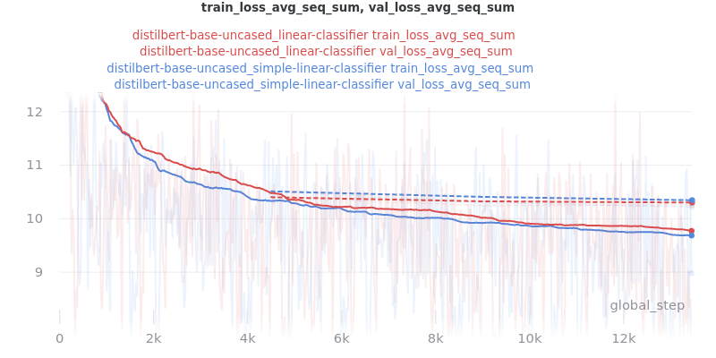

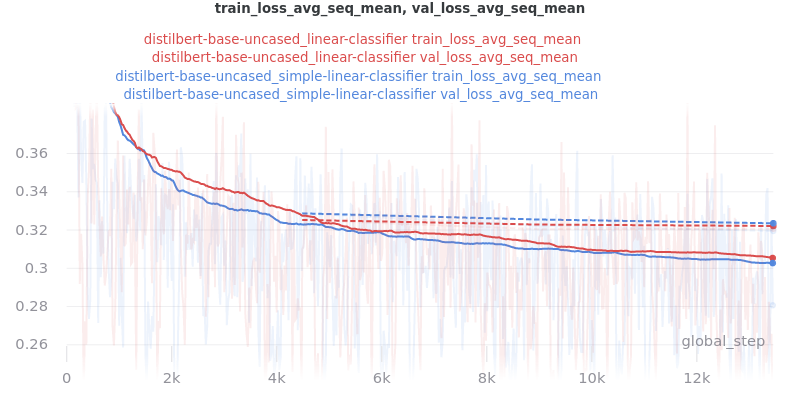

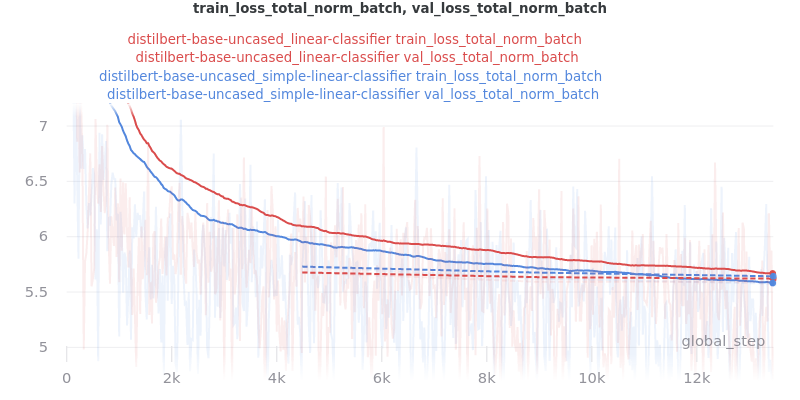

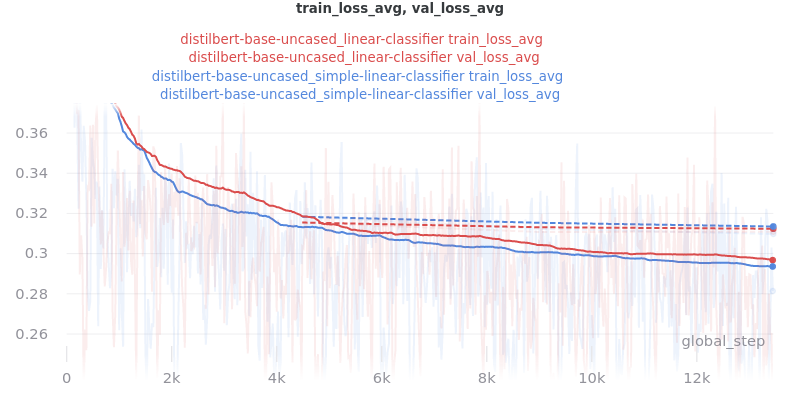

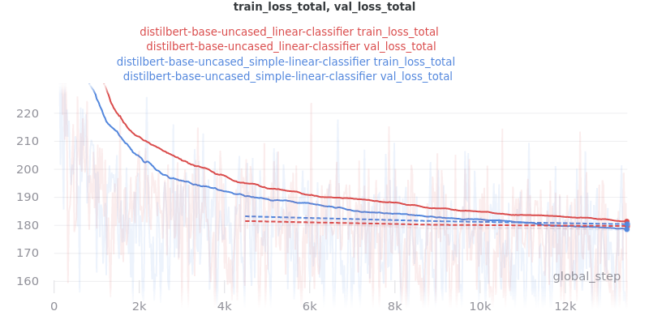

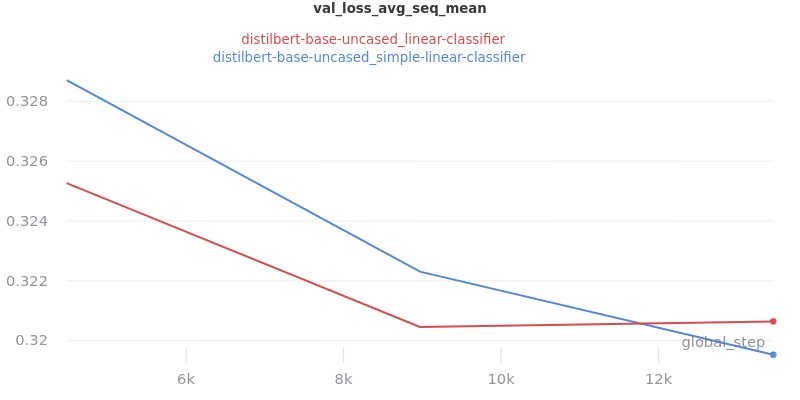

.. _older_experiments:

Version 1
---------

.. important:: These experiments may be difficult to reproduce because they were conducted on an early version of the project that contained several bugs.

**Reproducibility Notes:**

Bugs present in the version these experiments were conducted with:

1. Sentences were not split properly when computing ROUGE scores (fixed in commit dfefd15).
2. Data was missing from the training, validation, and testing sets (fixed in commit 4de5532).
3. Tokens were not converted to lowercase for models with the word "uncased" in their name (fixed in commit d934e09).
4. ``rougeLsum`` is not reported. See :ref:`about_rouge_scores` for the difference between ``rougeL`` and ``rougeLsum`` (fixed in commit d934e09).
5. Trigram blocking was not used (fixed in commit 60f868e).

Despite these differences from the official models, the relative results of these experiments should hold true, so their general findings should remain constant with newer models. If you find conflicting results please open an `issue <https://github.com/HHousen/TransformerSum/issues/new>`__.

.. _loss_function_experiments:

Loss Functions
^^^^^^^^^^^^^^

The loss function implementation can be found in the :meth:`extractive.ExtractiveSummarizer.compute_loss` function. The function uses ``nn.BCELoss`` with ``reduction="none"`` and then applies 5 different reduction techniques. Special reduction methods were needed to ignore padding and operate on the multi-class-per-document approach (each input is assigned more than one of the same class) that this research uses to perform extractive summarization. See the comments throughout the function for more information. The five different reduction methods were tested with the ``distilbert-base-uncased`` word embedding model and the ``pooling_mode`` set to ``sent_rep_tokens``. Training time is just under 4 hours on a Tesla P100 (3h52m average).

The ``--loss_key`` argument specifies the reduction method to use. It can be one of the following: ``loss_total``, ``loss_total_norm_batch``, ``loss_avg_seq_sum``, ``loss_avg_seq_mean``, ``loss_avg``.

Full command used to run the tests:

.. code-block::

   python main.py \
   --model_name_or_path distilbert-base-uncased \
   --no_use_token_type_ids \
   --pooling_mode sent_rep_tokens \
   --data_path ./cnn_dm_pt/bert-base-uncased \
   --max_epochs 3 \
   --accumulate_grad_batches 2 \
   --warmup_steps 1800 \
   --overfit_batches 0.6 \
   --gradient_clip_val 1.0 \
   --optimizer_type adamw \
   --use_scheduler linear \
   --profiler \
   --do_train --do_test \
   --loss_key [Loss Key Here] \
   --batch_size 32

Loss Functions Results
~~~~~~~~~~~~~~~~~~~~~~

Graph Legend Description: The ``loss-test`` label (the first part) is the experiment, which indicates the loss reduction method that was tested. The second part of each key is the graphed quantity. For example, the first line of the key for the first graph in the ``Outliers Included`` section below indicates that ``loss_avg`` was tested and that its results as measured by the ``loss_avg_seq_mean`` reduction method are shown in brown. The train results are solid brown and the validation results are dotted brown.

**Outliers Included:**

.. image:: ../_static/loss_functions/loss_avg_seq_mean_outliers.png
   :width: 48%

.. image:: ../_static/loss_functions/loss_total_outliers.png
   :width: 48%

**No Outliers:**

.. image:: ../_static/loss_functions/loss_avg_seq_mean.png
   :width: 48%

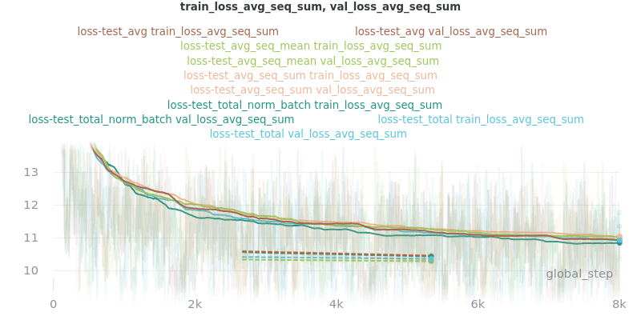

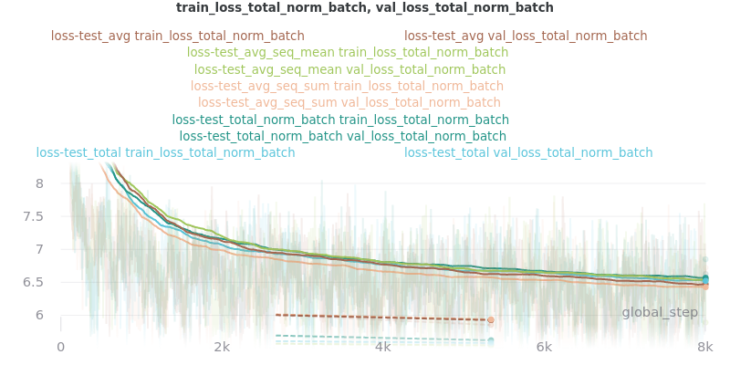

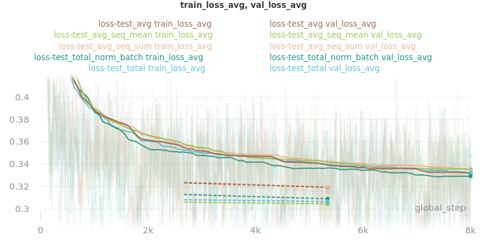

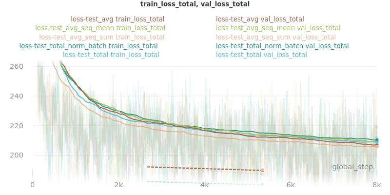

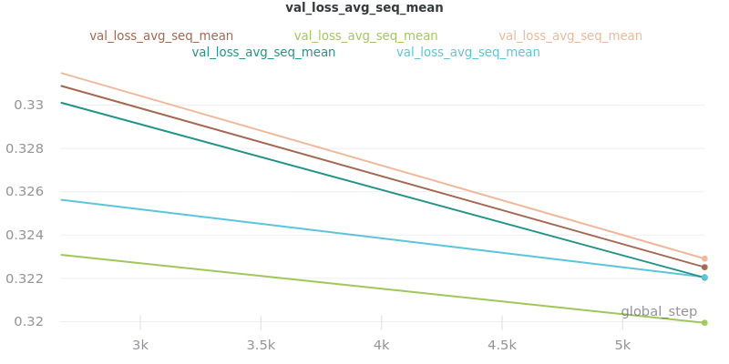

The CSV files the were used to generate the above graphs can be found in ``experiments/loss_functions``.

Based on the results, ``loss_avg_seq_mean`` was chosen as the default.

Word Embedding Models
^^^^^^^^^^^^^^^^^^^^^

Different transformer models of various architectures and sizes were tested.

Tested Models:

+------------+-----------------------------------------------------------------+------------+
| Model Type | Model Key                                                       | Batch Size |
+============+=================================================================+============+
| Distil*    | ``distilbert-base-uncased``, ``distilroberta-base``             | 16         |
+------------+-----------------------------------------------------------------+------------+
| Base       | ``bert-base-uncased``, ``roberta-base``, ``albert-base-v2``     | 16         |
+------------+-----------------------------------------------------------------+------------+
| Large      | ``bert-large-uncased``, ``roberta-large``, ``albert-xlarge-v2`` | 4          |
+------------+-----------------------------------------------------------------+------------+

**Albert Info:** The above batch sizes are true except for ``albert`` models, which have special batch sizes due to the increased memory needed to train them*. *``albert-base-v2`` was trained with a batch size of ``12`` and ``albert-xlarge-v2`` with a batch size of ``2``.*

+----------------+------------+--------+--------+-------+-----------+-------------------+
| Model          | Parameters | Layers | Hidden | Heads | Embedding | Parameter-sharing |
+================+============+========+========+=======+===========+===================+
| BERT-base      | 110M       | 12     | 768    | 12    | 768       | False             |
+----------------+------------+--------+--------+-------+-----------+-------------------+
| BERT-large     | 340M       | 24     | 1024   | 16    | 1024      | False             |
+----------------+------------+--------+--------+-------+-----------+-------------------+
| ALBERT-base    | 12M        | 12     | 768    | 12    | 128       | True              |
+----------------+------------+--------+--------+-------+-----------+-------------------+
| ALBERT-large   | 18M        | 24     | 1024   | 16    | 128       | True              |
+----------------+------------+--------+--------+-------+-----------+-------------------+
| ALBERT-xlarge  | 59M        | 24     | 2048   | 32    | 128       | True              |
+----------------+------------+--------+--------+-------+-----------+-------------------+
| ALBERT-xxlarge | 233M       | 12     | 4096   | 64    | 128       | True              |
+----------------+------------+--------+--------+-------+-----------+-------------------+

\*The huggingface/transformers documentation says "ALBERT uses repeating layers which results in a small memory footprint." This may be true but I found that the normal batch sizes I used for the base and large models would crash the training script when ``albert`` models were used. Thus, the batch sizes were decreased. The advantage that of ``albert`` that I found was incredibly small model weight checkpoint files (see results below for sizes).

All models were trained for 3 epochs (except ``albert-xlarge-v2``) (which will result in different numbers of steps but will ensure that each model saw the same amount of information), using the AdamW optimizer with a linear scheduler with 1800 steps of warmup. Gradients were accumulated every 2 batches and clipped at 1.0. **Only 60% of the data was used** (to decrease training time, but also will provide similar results if all the data was used). ``--no_use_token_type_ids`` was set if the model was not compatible with token type ids.

Full command used to run the tests:

.. code-block::

   python main.py \
   --model_name_or_path [Model Name] \
   --model_type [Model Type] \
   --pooling_mode sent_rep_tokens \
   --data_path ./cnn_dm_pt/[Model Type]-base \
   --max_epochs 3 \
   --accumulate_grad_batches 2 \
   --warmup_steps 1800 \
   --overfit_batches 0.6 \
   --gradient_clip_val 1.0 \
   --optimizer_type adamw \
   --use_scheduler linear \
   --profiler \
   --do_train --do_test \
   --batch_size [Batch Size]

WEB Results
~~~~~~~~~~~

The CSV files the were used to generate the below graphs can be found in ``experiments/web``.

All ``ROUGE Scores`` are test set results on the CNN/DailyMail dataset using ROUGE F1.

All model sizes are not compressed. They are the raw ``.ckpt`` output file sizes of the best performing epoch by ``val_loss``.

Final (Combined) Results
""""""""""""""""""""""""

The ``loss_total``, ``loss_avg_seq_sum``, and ``loss_total_norm_batch`` loss reduction techniques depend on the batch size. That is, the larger the batch size, the larger these losses will be. The ``loss_avg_seq_mean`` and ``loss_avg`` do not depend on the batch size since they are averages instead of totals. Therefore, only the non-batch-size-dependent metrics were used for the final results because difference batch sizes were used.

Distil\* Models
"""""""""""""""

More information about distil\* models found in the `huggingface/transformers examples <https://github.com/huggingface/transformers/tree/master/examples/distillation>`__.

.. warning:: Distil\* models do not accept token type ids. So set ``--no_use_token_type_ids`` while training using the above command.

**Training Times and Model Sizes:**

+-----------------------------+------------+------------+
| Model Key                   | Time       | Model Size |
+=============================+============+============+
| ``distilbert-base-uncased`` | 4h 5m 30s  | 810.6MB    |
+-----------------------------+------------+------------+
| ``distilroberta-base``      | 4h 12m 53s | 995.0MB    |
+-----------------------------+------------+------------+

**ROUGE Scores:**

+-------------------------+---------+---------+---------+
| Name                    | ROUGE-1 | ROUGE-2 | ROUGE-L |
+=========================+=========+=========+=========+
| distilbert-base-uncased | 40.1    | 18.1    | 26.0    |
+-------------------------+---------+---------+---------+
| distilroberta-base      | 40.9    | 18.7    | 26.4    |
+-------------------------+---------+---------+---------+

**Outliers Included:**

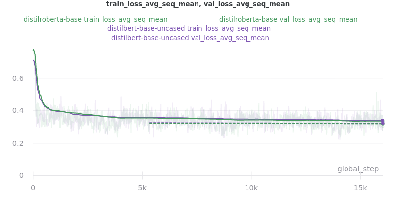

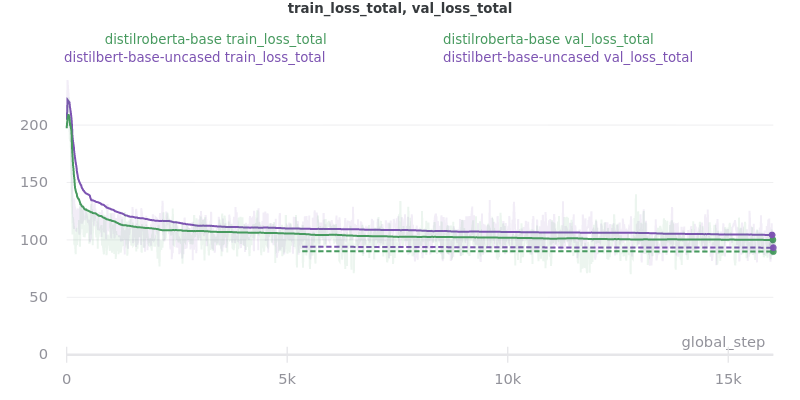

**No Outliers:**

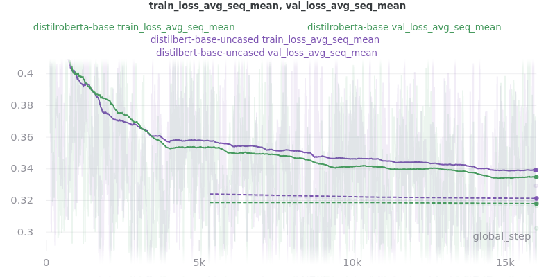

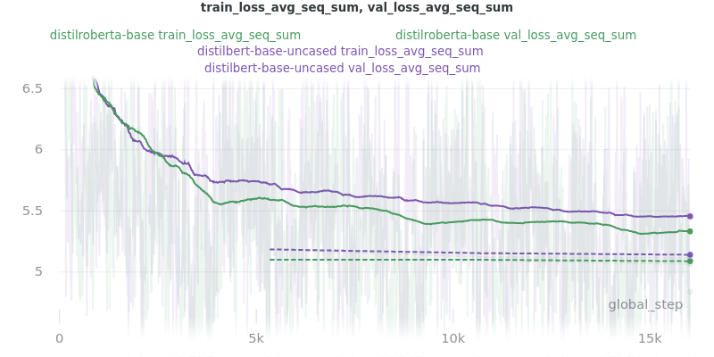

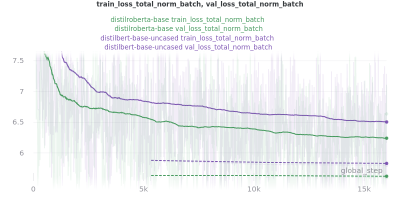

.. image:: ../_static/word_embedding_models/distil_loss_avg.png
   :width: 48%

.. image:: ../_static/word_embedding_models/distil_loss_total.png
   :width: 48%

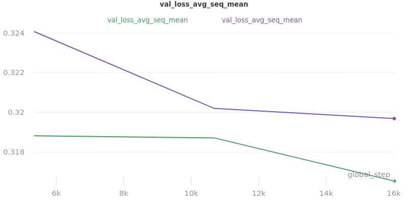

Base Models
"""""""""""

.. warning:: ``roberta-base`` does not accept token type ids. So set ``--no_use_token_type_ids`` while training using the above command.

**Training Times and Model Sizes:**

+-----------------------+------------+------------+
| Model Key             | Time       | Model Size |
+=======================+============+============+
| ``bert-base-uncased`` | 7h 56m 39s | 1.3GB      |
+-----------------------+------------+------------+
| ``roberta-base``      | 7h 52m 0s  | 1.5GB      |
+-----------------------+------------+------------+
| ``albert-base-v2``    | 7h 32m 19s | 149.7MB    |
+-----------------------+------------+------------+

**ROUGE Scores:**

+-------------------+---------+---------+---------+
| Name              | ROUGE-1 | ROUGE-2 | ROUGE-L |
+===================+=========+=========+=========+
| bert-base-uncased | 40.2    | 18.2    | 26.1    |
+-------------------+---------+---------+---------+
| roberta-base      | 42.3    | 20.1    | 27.4    |
+-------------------+---------+---------+---------+
| albert-base-v2    | 40.5    | 18.4    | 26.1    |
+-------------------+---------+---------+---------+

**Outliers Included:**

.. image:: ../_static/word_embedding_models/base_loss_avg_seq_mean_outliers.png
   :width: 48%

.. image:: ../_static/word_embedding_models/base_loss_total_outliers.png
   :width: 48%

**No Outliers:**

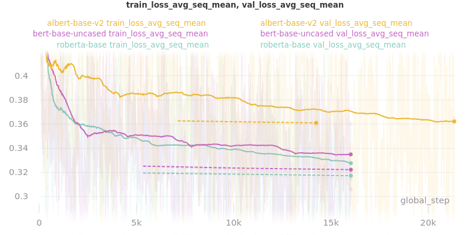

.. image:: ../_static/word_embedding_models/base_loss_avg_seq_sum.png
   :width: 48%

.. image:: ../_static/word_embedding_models/base_loss_total_norm_batch.png
   :width: 48%

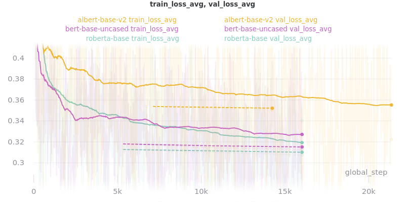

.. image:: ../_static/word_embedding_models/base_loss_total.png
   :width: 48%

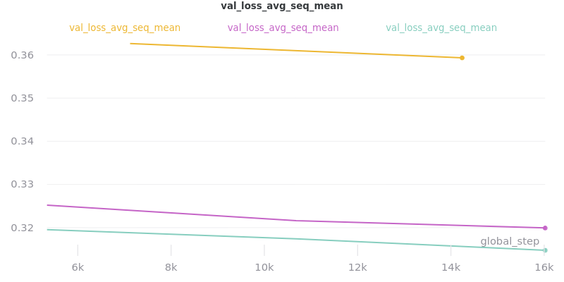

**Relative Time:**

This is included because the batch size for ``albert-base-v2`` had to be lowered to 12 (from 16).

.. image:: ../_static/word_embedding_models/base_loss_avg_seq_mean_reltime.png
   :width: 48%

Large Models
""""""""""""

.. warning:: ``roberta-large`` does not accept token type ids. So set ``--no_use_token_type_ids`` while training using the above command.

.. important:: ``albert-xlarge-v2`` (batch size 2) was set to be trained with for 2 epochs instead of 3, but was stopped early at ``global_step`` 56394.

**Training Times and Model Sizes:**

+------------------------+-------------+------------+
| Model Key              | Time        | Model Size |
+========================+=============+============+
| ``bert-large-uncased`` | 17h 55m 18s | 4.0GB      |
+------------------------+-------------+------------+
| ``roberta-large``      | 18h 32m 28s | 4.3GB      |
+------------------------+-------------+------------+
| ``albert-xlarge-v2``   | 21h 15m 54s | 708.9MB    |
+------------------------+-------------+------------+

**ROUGE Scores:**

+--------------------+---------+---------+---------+
| Name               | ROUGE-1 | ROUGE-2 | ROUGE-L |
+====================+=========+=========+=========+
| bert-large-uncased | 41.5    | 19.3    | 27.0    |
+--------------------+---------+---------+---------+
| roberta-large      | 41.5    | 19.3    | 27.0    |
+--------------------+---------+---------+---------+
| albert-xlarge-v2   | 40.7    | 18.4    | 26.1    |
+--------------------+---------+---------+---------+

**Outliers Included:**

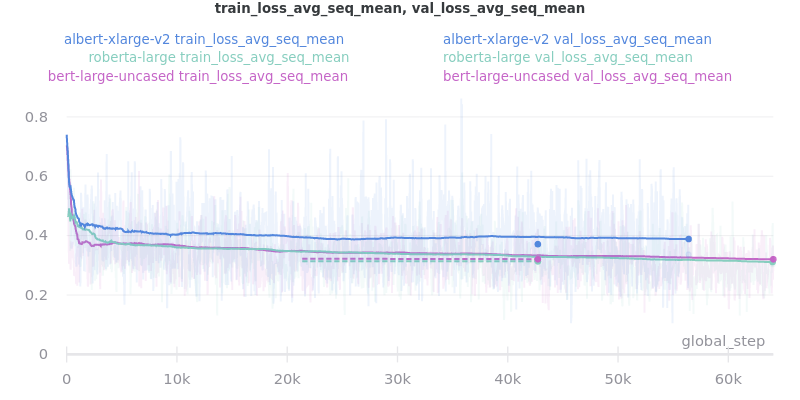

.. image:: ../_static/word_embedding_models/large_loss_total_outliers.png
   :width: 48%

**No Outliers:**

.. image:: ../_static/word_embedding_models/large_loss_avg_seq_mean.png
   :width: 48%

.. image:: ../_static/word_embedding_models/large_loss_avg_seq_sum.png
   :width: 48%

.. image:: ../_static/word_embedding_models/large_loss_total_norm_batch.png
   :width: 48%

.. image:: ../_static/word_embedding_models/large_loss_avg.png
   :width: 48%

.. image:: ../_static/word_embedding_models/large_loss_total.png
   :width: 48%

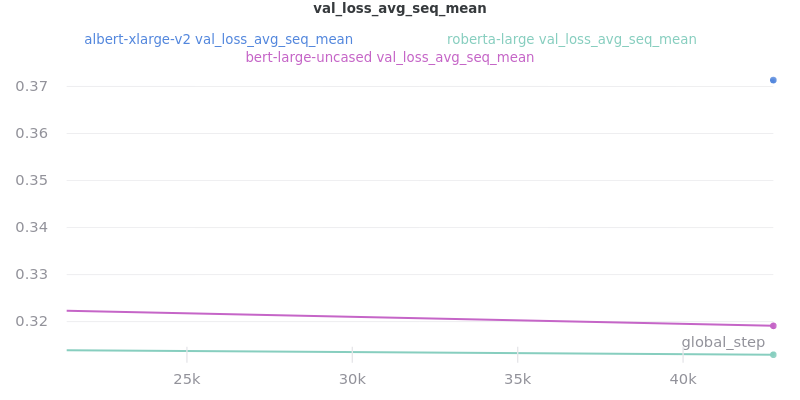

**Relative Time:**

This is included because the batch size for ``albert-large-v2`` had to be lowered to 2 (from 4).

.. image:: ../_static/word_embedding_models/large_loss_avg_seq_mean_reltime.png
   :width: 48%

Pooling Mode
^^^^^^^^^^^^

See `the main README.md <../README.md>`__ for more information on what the pooling model is.

The two options, ``sent_rep_tokens`` and ``mean_tokens``, were both tested with the ``bert-base-uncased`` and ``distilbert-base-uncased`` word embedding models.

Full command used to run the tests:

.. code-block::

   python main.py \
   --model_name_or_path [Model Name] \
   --model_type [Model Type] \
   --pooling_mode [`mean_tokens` or `sent_rep_tokens`] \
   --data_path ./cnn_dm_pt/[Model Type]-base \
   --max_epochs 3 \
   --accumulate_grad_batches 2 \
   --warmup_steps 1800 \
   --overfit_batches 0.6 \
   --gradient_clip_val 1.0 \
   --optimizer_type adamw \
   --use_scheduler linear \
   --profiler \
   --do_train --do_test \
   --batch_size 16

Pooling Mode Results
~~~~~~~~~~~~~~~~~~~~

**Training Times and Model Sizes:**

+---------------------------------------------+------------+------------+
| Model Key                                   | Time       | Model Size |
+=============================================+============+============+
| ``distilbert-base-uncased`` mean_tokens     | 5h 18m 1s  | 810.6MB    |
+---------------------------------------------+------------+------------+
| ``distilbert-base-uncased`` sent_rep_tokens | 4h 5m 30s  | 810.6MB    |
+---------------------------------------------+------------+------------+
| ``bert-base-uncased`` mean_tokens           | 8h 22m 46s | 1.3GB      |
+---------------------------------------------+------------+------------+
| ``bert-base-uncased`` sent_rep_tokens       | 7h 56m 39s | 1.3GB      |
+---------------------------------------------+------------+------------+

**ROUGE Scores:**

+-----------------------------------------+---------+---------+---------+
| Name                                    | ROUGE-1 | ROUGE-2 | ROUGE-L |
+=========================================+=========+=========+=========+
| distilbert-base-uncased mean_tokens     | 41.1    | 18.8    | 26.5    |
+-----------------------------------------+---------+---------+---------+
| distilbert-base-uncased sent_rep_tokens | 40.1    | 18.1    | 26.0    |
+-----------------------------------------+---------+---------+---------+
| bert-base-uncased mean_tokens           | 40.7    | 18.7    | 26.6    |
+-----------------------------------------+---------+---------+---------+
| bert-base-uncased sent_rep_tokens       | 40.2    | 18.2    | 26.1    |
+-----------------------------------------+---------+---------+---------+

**Main Takeaway:** Using the ``mean_tokens`` ``pooling_mode`` is associated with a *0.617 average ROUGE F1 score improvement* over the ``sent_rep_tokens`` ``pooling_mode``. This improvement is at the cost of a *49.3 average minute (2959 seconds) increase in training time*.

**Outliers Included:**

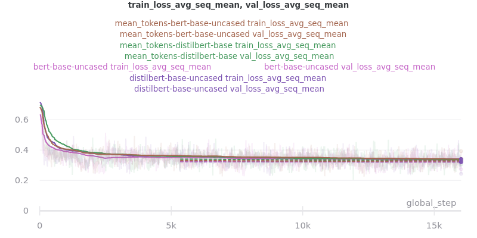

.. image:: ../_static/pooling_mode/loss_total_outliers.png
   :width: 48%

**No Outliers:**

.. image:: ../_static/pooling_mode/loss_avg_seq_sum.png
   :width: 48%

.. image:: ../_static/pooling_mode/loss_avg_seq_mean.png
   :width: 48%

.. image:: ../_static/pooling_mode/loss_total_norm_batch.png
   :width: 48%

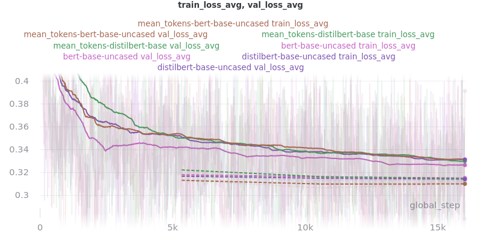

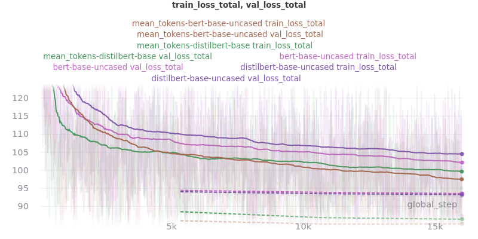

.. image:: ../_static/pooling_mode/loss_avg_seq_mean_val_only.png
   :width: 48%

**Relative Time:**

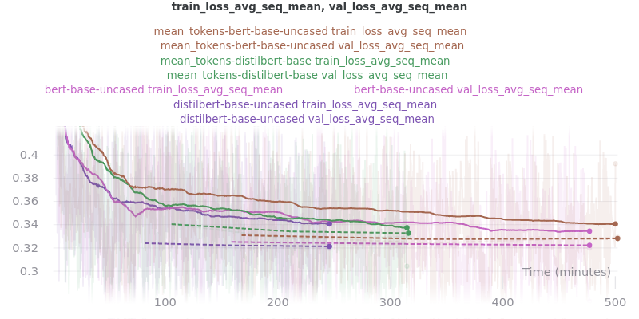

Classifier/Encoder
^^^^^^^^^^^^^^^^^^

The classifier/encoder is responsible for removing the hidden features from each sentence embedding and converting them to a single number. The ``linear``, ``transformer`` (with 2 layers), ``transformer`` (with 6 layers "``--classifier_transformer_num_layers 6``"), and ``transformer_linear`` options were tested with the ``distilbert-base-uncased`` model. The ``transformer_linear`` test has a transformer with *2 layers* (like the ``transformer`` test).

Unlike the experiments prior to this one (above), the "Classifier/Encoder" experiment used a ``--train_percent_check`` of 0.6, ``--val_percent_check`` of 0.6 and ``--test_percent_check`` of **1.0**. All of the data was used for testing whereas 60% of it was used for training and validation.

Full command used to run the tests:

.. code-block::

   python main.py \
   --model_name_or_path [Model Name] \
   --model_type distilbert \
   --no_use_token_type_ids \
   --classifier [`linear` or `transformer` or `transformer_linear`] \
   [--classifier_transformer_num_layers 6 \]
   --data_path ./cnn_dm_pt/bert-base-uncased \
   --max_epochs 3 \
   --accumulate_grad_batches 2 \
   --warmup_steps 1800 \
   --train_percent_check 0.6 --val_percent_check 0.6 --test_percent_check 1.0 \
   --gradient_clip_val 1.0 \
   --optimizer_type adamw \
   --use_scheduler linear \
   --profiler \
   --do_train --do_test \
   --batch_size 16

Classifier/Encoder Results
~~~~~~~~~~~~~~~~~~~~~~~~~~

**Training Times and Model Sizes:**

+----------------------------+------------+------------+
| Model Key                  | Time       | Model Size |
+============================+============+============+
| ``linear``                 | 3h 59m 1s  | 810.6MB    |
+----------------------------+------------+------------+
| ``transformer`` (2 layers) | 4h 9m 29s  | 928.8MB    |
+----------------------------+------------+------------+
| ``transformer`` (6 layers) | 4h 21m 29s | 1.2GB      |
+----------------------------+------------+------------+
| ``transformer_linear``     | 4h 9m 59s  | 943.0MB    |
+----------------------------+------------+------------+

**ROUGE Scores:**

+----------------------------+---------+---------+---------+
| Name                       | ROUGE-1 | ROUGE-2 | ROUGE-L |
+============================+=========+=========+=========+
| ``linear``                 | 41.2    | 18.9    | 26.5    |
+----------------------------+---------+---------+---------+
| ``transformer`` (2 layers) | 41.2    | 18.8    | 26.5    |
+----------------------------+---------+---------+---------+
| ``transformer`` (6 layers) | 41.0    | 18.9    | 26.5    |
+----------------------------+---------+---------+---------+
| ``transformer_linear``     | 40.9    | 18.7    | 26.6    |
+----------------------------+---------+---------+---------+

**Main Takeaway:** The ``transformer`` encoder had a much better loss curve, indicating that it is able to learn more about choosing the more representative sentences. However, its ROUGE scores are nearly identical to the ``linear`` encoder, which suggests both encoders capture enough information to summarize. The ``transformer`` encoder may potentially work better on more complex datasets.

**Outliers Included:**

.. image:: ../_static/encoder/loss_avg_seq_mean_outliers.png
   :width: 48%

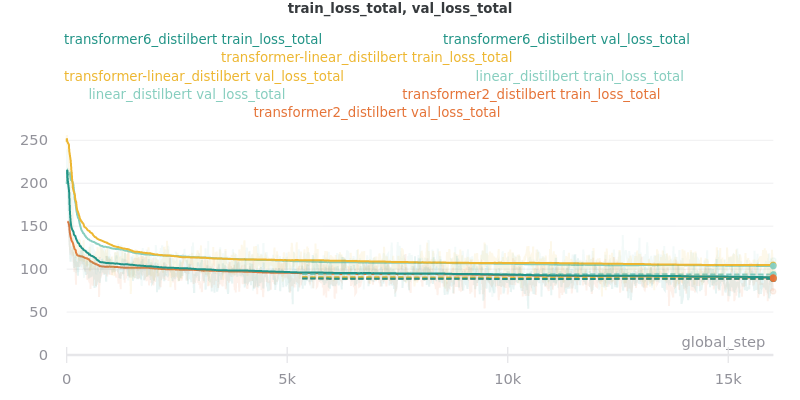

**No Outliers:**

.. image:: ../_static/encoder/loss_avg_seq_sum.png
   :width: 48%

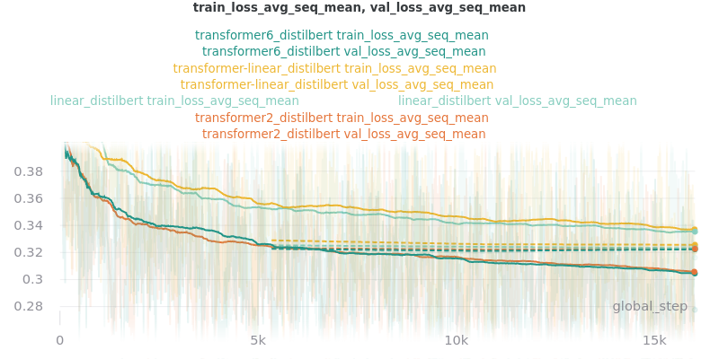

.. image:: ../_static/encoder/loss_total_norm_batch.png
   :width: 48%

.. image:: ../_static/encoder/loss_avg.png
   :width: 48%

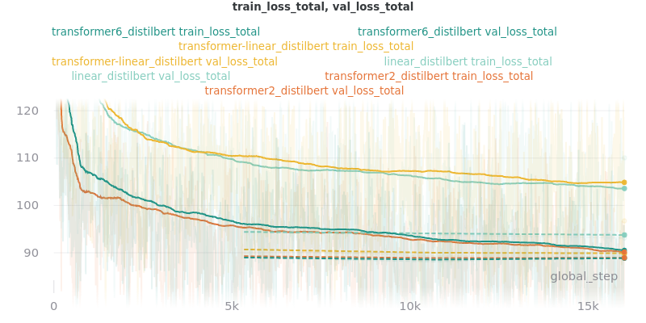

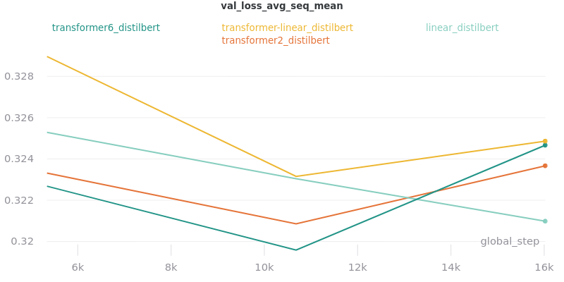

**Relative Time:**

.. image:: ../_static/encoder/loss_avg_seq_mean_reltime.png
   :width: 48%