# Experiments

## Loss Functions

The loss function implementation can be found in [model.py](model.py) with signature `compute_loss(self, outputs, labels, mask)`. The function uses `nn.BCELoss` with `reduction="none"` and then applies 5 different reduction techniques. Special reduction methods were needed to ignore padding and operate on the multi-class-per-document approach (each input is assigned more than one of the same class) that this research uses to perform extractive summarization. See the comments throughout the function for more information. The five different reduction methods were tested with the `distilbert-base-uncased` word embedding model and the `pooling_mode` set to `sent_rep_tokens`. Training time is just under 4 hours on a Tesla P100 (3h52m average).

The `--loss_key` argument specifies the reduction method to use. It can be one of the following: `loss_total`, `loss_total_norm_batch`, `loss_avg_seq_sum`, `loss_avg_seq_mean`, `loss_avg`.

Full command used to run the tests:

```
python main.py \
--model_name_or_path distilbert-base-uncased \
--no_use_token_type_ids \
--pooling_mode sent_rep_tokens \
--data_path ./cnn_dm_pt/bert-base-uncased \
--max_epochs 3 \
--accumulate_grad_batches 2 \
--warmup_steps 1800 \
--overfit_pct 0.6 \
--gradient_clip_val 1.0 \
--optimizer_type adamw \
--use_scheduler linear \
--profiler \
--do_train --do_test \
--loss_key [Loss Key Here] \
--val_batch_size 32 --train_batch_size 32 --test_batch_size 32
```

### Loss Functions Results

Graph Legend Description: The `loss-test` label (the first part) is the experiment, which indicates the loss reduction method that was tested. The second part of each key is the graphed quantity. For example, the first line of the key for the first graph in the `Outliers Included` section below indicates that `loss_avg` was tested and that its results as measured by the `loss_avg_seq_mean` reduction method are shown in brown. The train results are solid brown and the validation results are dotted brown.

**Outliers Included:**

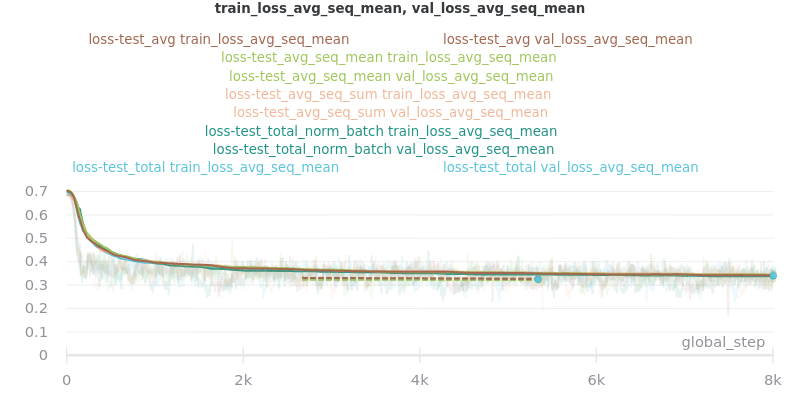 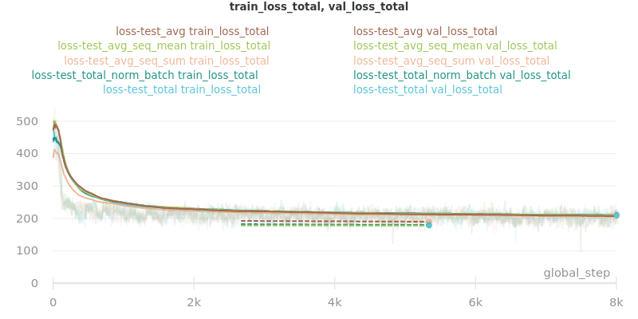

**No Outliers:**

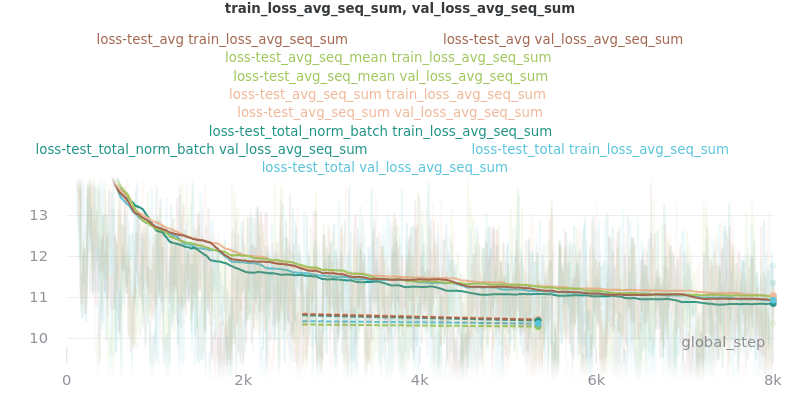 

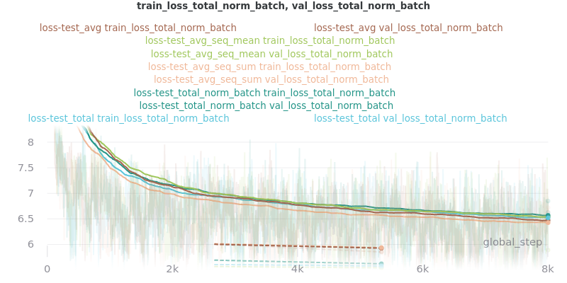 

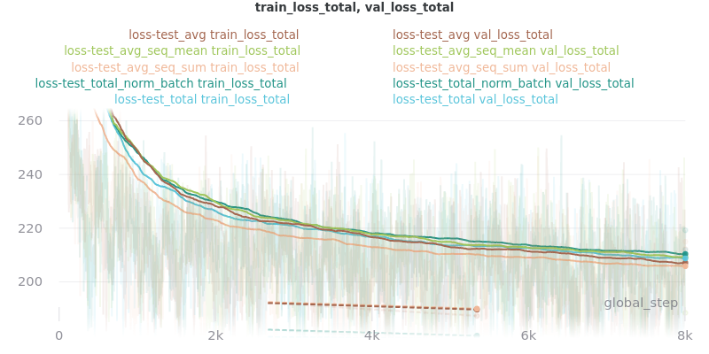 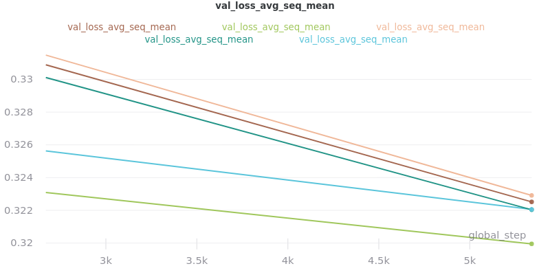

The CSV files the were used to generate the above graphs can be found in `experiments/loss_functions`.

Based on the results, `loss_avg_seq_mean` was chosen as the default.

## Word Embedding Models

Different transformer models of various architectures and sizes were tested.

Tested Models:

| Model Type | Model Key                                                 | Batch Size |
|------------|-----------------------------------------------------------|------------|
| Distil*    | `distilbert-base-uncased`, `distilroberta-base`           | 16         |
| Base       | `bert-base-uncased`, `roberta-base`, `albert-base-v2`     | 16         |
| Large      | `bert-large-uncased`, `roberta-large`, `albert-xlarge-v2` | 4          |

**Important Note:** The above batch sizes are true except for `albert` models, which have special batch sizes due to the increased memory needed to train them*. *`albert-base-v2` was trained with a batch size of `12` and `albert-xlarge-v2` with a batch size of `2`.*

*The huggingface/transformers documentation says "ALBERT uses repeating layers which results in a small memory footprint." This may be true but I found that the normal batch sizes I used for the base and large models would crash the training script when `albert` models were used. Thus, the batch sizes were decreased.

All models were trained for 3 epochs (which will result in different numbers of steps but will ensure that each model saw the same amount of information), using the AdamW optimizer with a linear scheduler with 1800 steps of warmup. Gradients were accumulated every 2 batches and clipped at 1.0. **Only 60% of the data was used** (to decrease training time, but also will provide similar results if all the data was used). `--no_use_token_type_ids` was set if the model was not compatible with token type ids.

Full command used to run the tests:

```
!python main.py \
--model_name_or_path [Model Name] \
--model_type [Model Type] \
--pooling_mode sent_rep_tokens \
--data_path ./cnn_dm_pt/[Model Type]-base \
--max_epochs 3 \
--accumulate_grad_batches 2 \
--warmup_steps 1800 \
--overfit_pct 0.6 \
--gradient_clip_val 1.0 \
--optimizer_type adamw \
--use_scheduler linear \
--profiler \
--do_train --do_test \
--val_batch_size [Batch Size] --train_batch_size [Batch Size] --test_batch_size [Batch Size]
```

### WEB Results

The CSV files the were used to generate the below graphs can be found in `experiments/web`.

All `ROUGE Scores` are test set results on the CNN/DailyMail dataset using ROUGE F<sub>1</sub>.

#### Final (Combined) Results

The `loss_total`, `loss_avg_seq_sum`, and `loss_total_norm_batch` loss reduction techniques depend on the batch size. That is, the larger the batch size, the larger these losses will be. The `loss_avg_seq_mean` and `loss_avg` do not depend on the batch size since they are averages instead of totals. Therefore, only the non-batch-size-dependent metrics were used for the final results because difference batch sizes were used.

#### Distil* Models

More information about distil* models found in the [huggingface/transformers examples](https://github.com/huggingface/transformers/tree/master/examples/distillation).

**Important Note:** Distil* models do not accept token type ids. So set `--no_use_token_type_ids` while training using the above command.

**Training Times:**

| Model Key                 | Time       |
|---------------------------|------------|
| `distilbert-base-uncased` | 4h 5m 30s  |
| `distilroberta-base`      | 4h 12m 53s |

**ROUGE Scores:**

| Name                    | ROUGE-1    | ROUGE-2    | ROUGE-L    |
|-------------------------|------------|------------|------------|
| distilbert-base-uncased | Not yet... | Not yet... | Not yet... |
| distilroberta-base      | 40.9       | 18.7       | 26.4       |

**Outliers Included:**

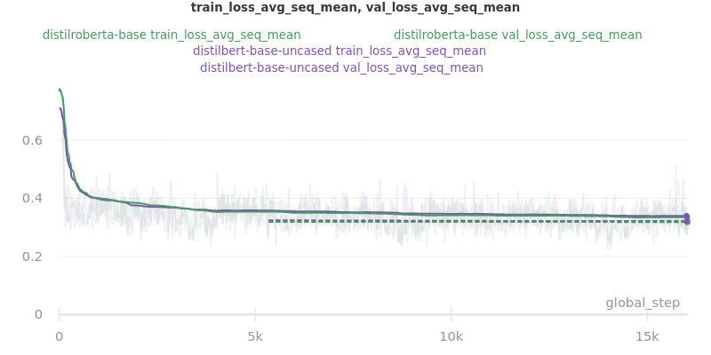 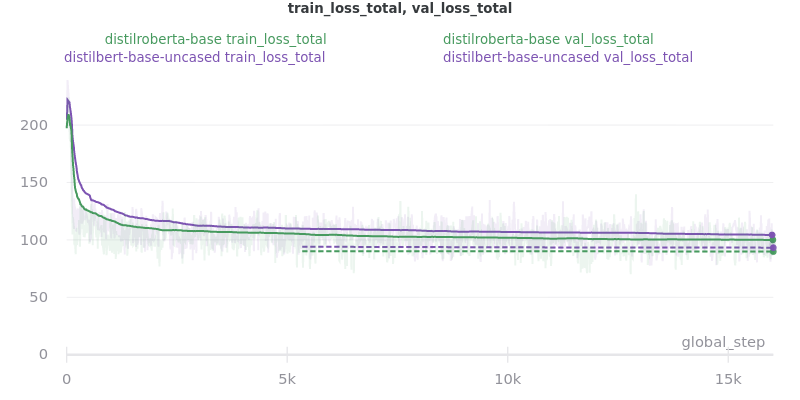

**No Outliers:**

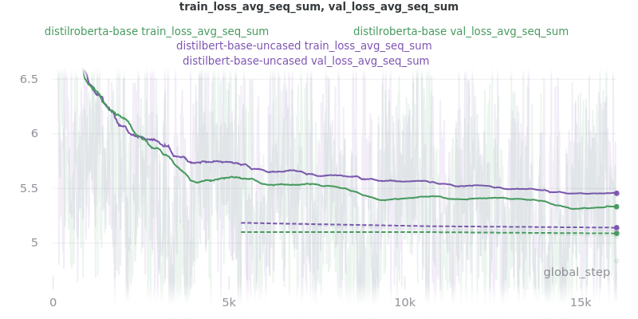 

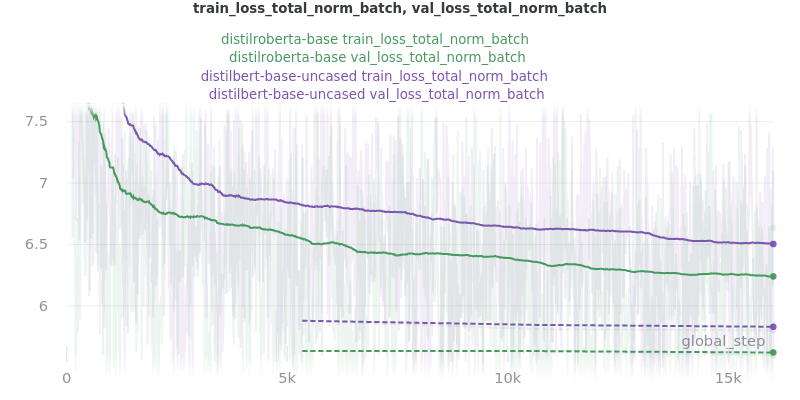 

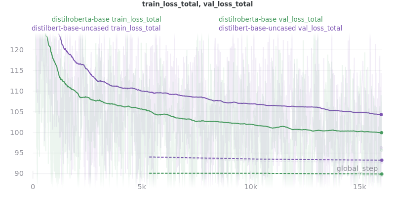 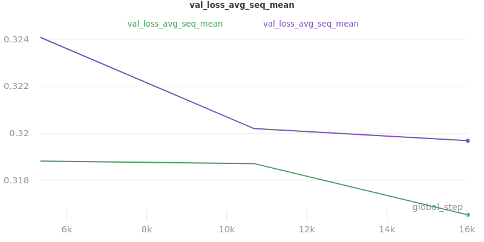

#### Base Models

**Important Note:** `roberta-base` does not accept token type ids. So set `--no_use_token_type_ids` while training using the above command.

**Training Times:**

| Model Key           | Time       |
|---------------------|------------|
| `bert-base-uncased` | 7h 56m 39s |
| `roberta-base`      | 7h 52m 0s  |
| `albert-base-v2`    | 7h 32m 19s |

**ROUGE Scores:**

| Name              | ROUGE-1 | ROUGE-2 | ROUGE-L |
|-------------------|---------|---------|---------|
| bert-base-uncased | 40.2    | 18.2    | 26.1    |
| roberta-base      | 42.3    | 20.1    | 27.4    |
| albert-base-v2    | 40.5    | 18.4    | 26.1    |

**Outliers Included:**

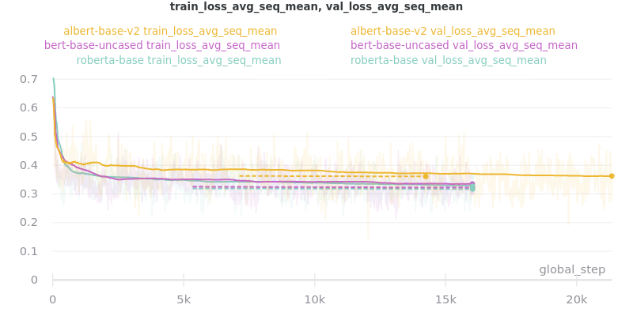 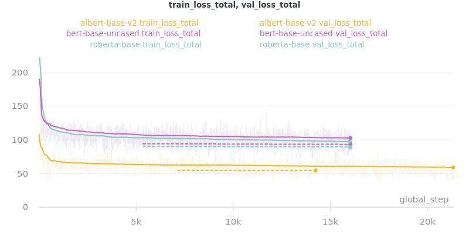

**No Outliers:**

 

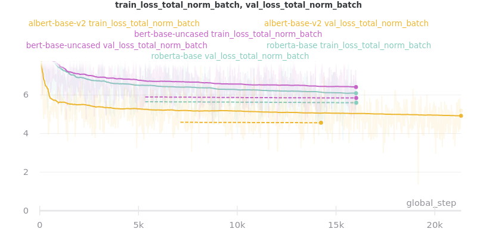 

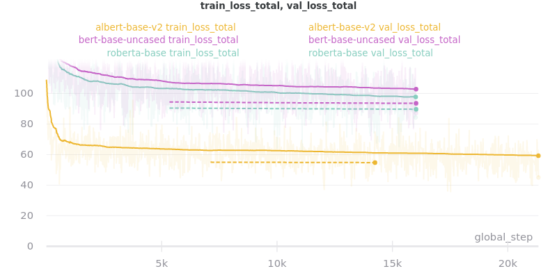 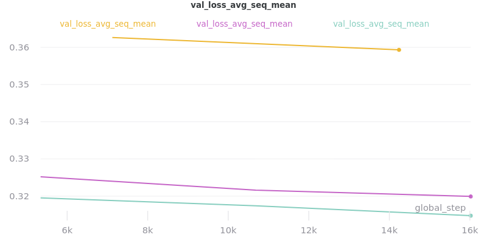

**Relative Time:**

This is included because the batch size for albert-base-v2 had to be lowered to 12 (from 16).

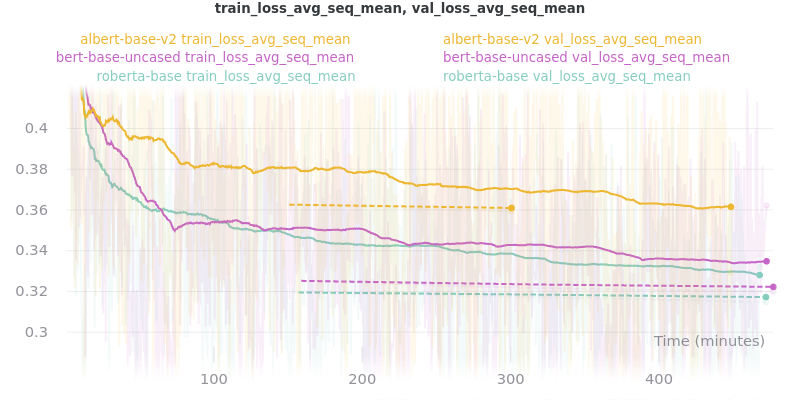


#### Large Models

**Training Times:**

| Model Key            | Time           |
|----------------------|----------------|
| `bert-large-uncased` | Coming soon... |
| `roberta-large`      | Coming soon... |
| `albert-xlarge-v2`   | Coming soon... |

**ROUGE Scores:**

| Name               | ROUGE-1    | ROUGE-2    | ROUGE-L    |
|--------------------|------------|------------|------------|
| bert-large-uncased | Not yet... | Not yet... | Not yet... |
| roberta-large      | Not yet... | Not yet... | Not yet... |
| albert-xlarge-v2   | Not yet... | Not yet... | Not yet... |


## Pooling Mode

See [the main README.md](../README.md) for more information on what the pooling model is.

The two options, `sent_rep_tokens` and `mean_tokens`, were both tested with the `bert-base-uncased` and `distilbert-base-uncased` word embedding models.

### Pooling Mode Results

Coming soon...
